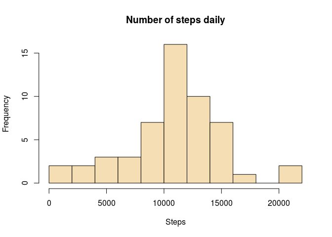

# Activity Pattern Assignment

## What is mean total number of steps taken per day?

#### Loading data


```r
activity<-read.csv("activity.csv")
library(dplyr)
```

```
## 
## Attaching package: 'dplyr'
## 
## The following object is masked from 'package:stats':
## 
##     filter
## 
## The following objects are masked from 'package:base':
## 
##     intersect, setdiff, setequal, union
```

#### Histogram and reporting mean and median

```r
steps_act<-activity[complete.cases(activity),]
by_date<-group_by(steps_act,date)
daily_steps<-summarise(by_date,sum(steps))
names(daily_steps)<-c("date","steps")
hist(daily_steps$steps,main="Number of steps daily",xlab="Steps",col="wheat", breaks=10)
```

 

```r
mean_steps<-mean(daily_steps$steps)
mean_steps
```

```
## [1] 10766.19
```

```r
median_steps<-median(daily_steps$steps)
median_steps
```

```
## [1] 10765
```

* The mean of the steps per day is 1.0766189\times 10^{4} steps.
* The median of the steps per day is 10765 steps.

## What is the average daily activity pattern? 

#### Average number of steps taken for all days per 5-minute intervals


```r
by_interval<-group_by(steps_act,interval)
mean_interval<-summarise(by_interval,mean(steps))
names(mean_interval)<-c("steps","mean_steps")
plot(mean_interval,type='l', main="Average number of steps per interval for all days", xlab="Interval",ylab="Average Steps")
```

 

#### Reporting the interval with max value of steps 

The following computes the maximum average number of steps over all days and the interval with this maximum number of steps


```r
max_steps<-max(mean_interval[,2])
max_int<-as.numeric(filter(mean_interval,mean_steps==max(mean_interval[,2]))[1,1])
max_int
```

```
## [1] 835
```

* The maximum average number of steps over all days is 206.1698113 for interval 835

### Imputting missing values

#### Number of NA values

Here we first find the number of NA values in the variable steps


```r
na_values_count<-sum(is.na(activity$steps))
na_values_count
```

```
## [1] 2304
```
The number of NA values is 2304.

#### Replacing NA values and creating a new dataset with all NA values filled

We replace each NA with the mean for that interval; i.e if for example for day 2012-10-01 and interval 25 the variable steps has NA value, we replace the NA value with the mean for interval 25 over all days. 

The following code 

* creates a copy of the activity label, called activity_f 
* performs this replacement/filling of the table.


```r
activity_f<-activity
for(i in 1:nrow(activity_f))
  { 
    if(is.na(activity_f$steps[i]))
      {activity_f$steps[i]<-mean(activity_f[activity_f$interval==activity_f$interval[i],]$steps,na.rm=TRUE)}
  }
```

#### Histogram and reporting mean and median

The following computed the total number of steps for each day and plots the histogram


```r
by_date_f<-group_by(activity_f,date)
daily_steps_f<-summarise(by_date_f,sum(steps))
names(daily_steps_f)<-c("date","steps")
hist(daily_steps_f$steps,main="Number of steps daily",xlab="Steps",col="wheat",breaks=10)
```

 

```r
mean_steps_f<-mean(daily_steps_f$steps)
mean_steps_f
```

```
## [1] 10766.19
```

```r
median_steps_f<-median(daily_steps_f$steps)
median_steps_f
```

```
## [1] 10766.19
```

* The mean of the steps per day is 1.0766189\times 10^{4} steps.
* The median of the steps per day is 1.0766189\times 10^{4} steps.

#### Difference between data: comparing results from first part with results with missing values replaced

* the height/frequency of the mean value in histogram is larger
* median differs from the median in the first part, since we have now different number of observations: we substituted the missing values with the average (mean) value for that interval. The median is now equal to mean, since there were multiple days with NA's for all intervals and those got replaced by the average values. Therefore the total number of steps for such "NA days"" is equal to the mean and the median is allocated within "NA days".

## Are there differences in activity patterns between weekdays and weekends?

#### Creating a new (factor) variable in dataset indicating day of the week


```r
library(lubridate)
activity_f<-mutate(activity_f,day_type=wday(date)<7&wday(date)>1)
activity_f[activity_f$day_type==T,]$day_type<-"weekend"
activity_f[activity_f$day_type==F,]$day_type<-"weekday"
activity_f<-transform(activity_f,day_type=factor(day_type))
```

#### Panel plot of the average number of steps taken averaged over all weekend/weekdays


```r
library(lattice)
by_int_day_t<-group_by(activity_f,interval,day_type)
act_int_day_t<-summarise(by_int_day_t,Steps=mean(steps))
xyplot(Steps~interval|day_type,data=act_int_day_t,layout=c(1,2),type='l',xlab="Interval",ylab="Number of steps") 
```

 
